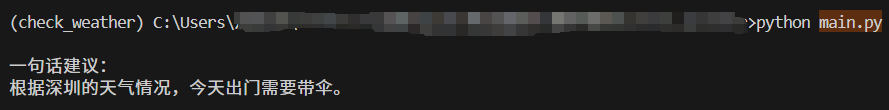

# 基于函数调用的最小智能体工作流：查深圳天气并一句话告知是否带伞

一个最小可运行的示例：使用 **智谱 AI (`glm-4`)**，通过函数调用获取城市天气，并只用一句中文告诉你需不需要带伞。

> 参考文档：  
> 智谱AI API的使用：https://blog.csdn.net/qq_51699436/article/details/140137885

 **API Key 填写位置**：  
  在 `run_agent()` 里这行替换为你的 Key  
  ```python
  client = ZhipuAI(api_key="YOUR_API_KEY")
  ```

---
## 运行环境

**Python 3.10**

---

## 安装依赖

```bash
pip install zhipuai==2.1.5.20250726
```

## 模型使用
```python
model = "glm-4"
```

## 运行方法
```bash
python main.py
```

## 运行截图


## 借助 ChatGPT/搜索完成的部分
- `tools` 和 `tool_choice="auto"` 的配置方式参考了ChatGPT提供的示例。  
- `tool_calls` 的解析与参数提取 (`json.loads(tc.function.arguments)`) 由 ChatGPT 给出实现思路。  